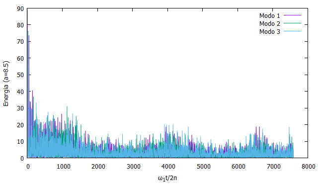

# fput
brincando com o problema de fermi-pasta-ulam-tsingou

## Energia por modo
<figure>
<figurecaption>Energia por modo pelo método de Verlet com N=32 dt=0.001 alfa=0.25.</figurecaption>

</figure>

## Lendo os dados de FPUT_KAM.c
Para visualização dos dados do arquivo fpu.dat utilizar os scripts do plots.gnu
<figure>
<figurecaption>Energia por modo para N=32 dt-0.001 alfa=0.25 a=8.5. A recorrência desaparece e a equipartição de energia é recuperada.</figurecaption>

</figure>
<figure>
<figurecaption>Eta para diferentes amplitudes iniciais (log). Eta é um parâmetro definido entre zero e um, que corresponde, respectivamente, a equipartição de energia e a situação onde o estado inicial se repete (recorrência).</figurecaption>

</figure>
