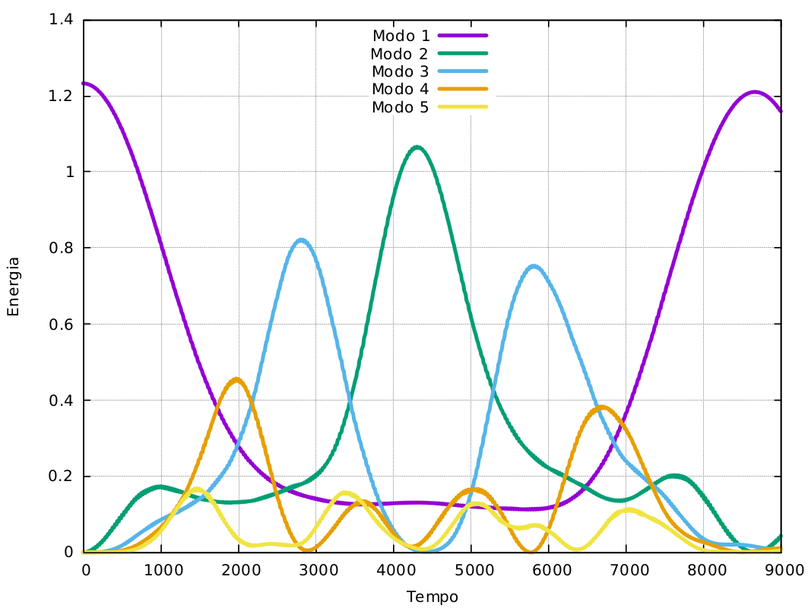

# fput
brincando com o problema de fermi-pasta-ulam-tsingou

## Energia por modo
<figure>
<figurecaption>Energia por modo pelo método de Verlet com N=32 dt=0.001 alfa=0.25.</figurecaption>

</figure>

## Lendo os dados de FPUT_KAM.c
Para visualização dos dados do arquivo fpu.dat utilizar os scripts do plots.gnu
